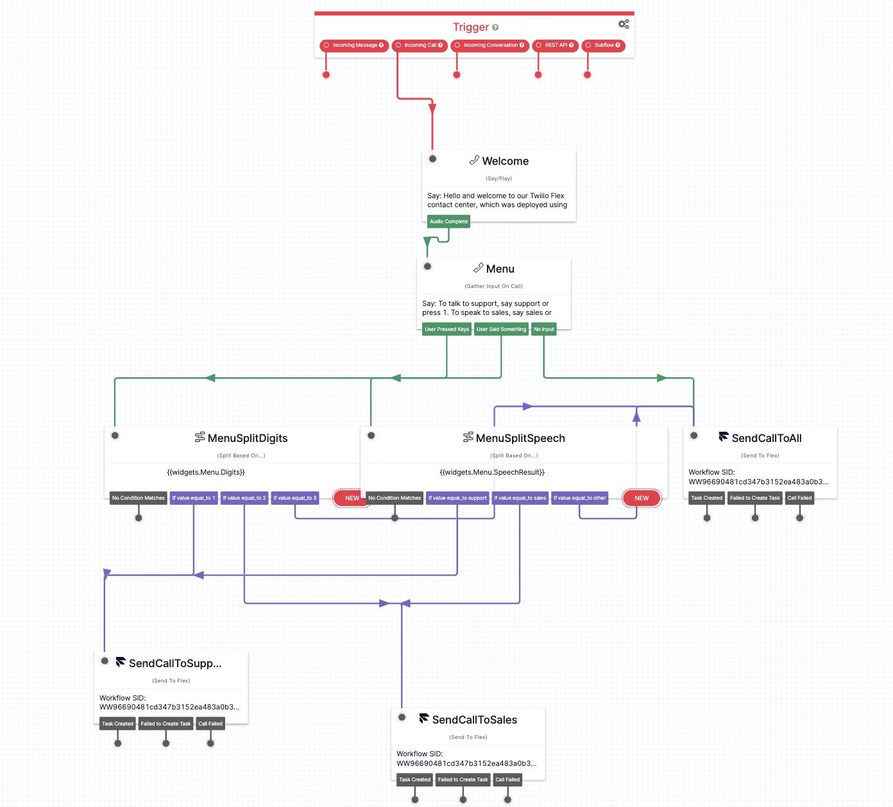
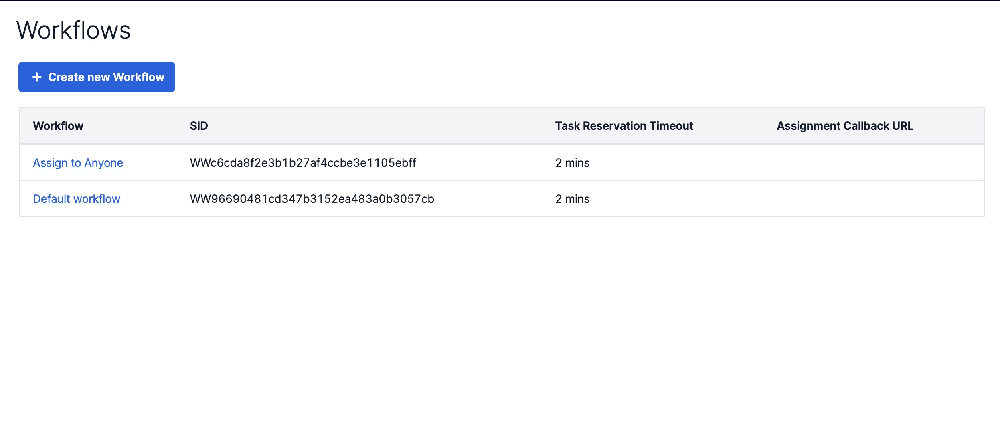
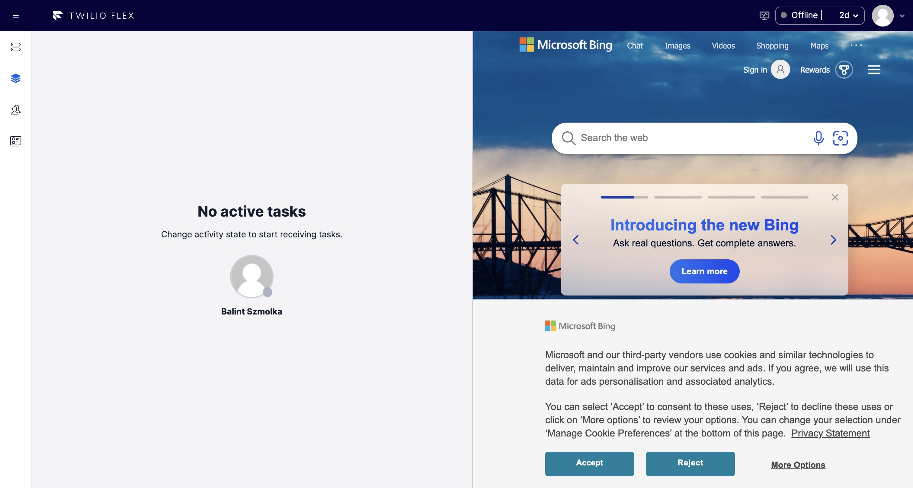

# Twilio Flex with Terraform 

This repository contains terraform configuration for deploying a [Twilio Flex](https://www.twilio.com/en-us/flex) contact center, including all of its common components: an IVR (Studio flow), rules for routing tasks to agents (Taskrouter configuration), and a Flex plugin for customization.

It can be used as a blueprint for provisioning a Twilio Flex  contact center using code. 

## Table of contents
* [Why IaC?](#iac)
* [Structure](#structure)
* [Design](#design)
* [Setup](#setup)
* [Maintainer](#maintainer)

## Why IaC?

Provisioning and managing your contact center infrastructure as code offers several benefits, including:
- *Efficiency*: using IaC, you can automate the provisioning of your resources, leading to faster deployment of your contact center infrastructure.
- *Consistency*: IaC enables you to easily deploy multiple instances of your contact center infrastructure and maintain consistency across all environments. 
- *Version control*: with IaC, you can version control your infrastructure, which makes it easy to track and audit changes, as well as to switch between different versions of your contact center configuration.

## Design

A Twilio Flex contact center deployment usually consists of the following components:
- *Studio:* Studio is a visual application builder for creating communication workflows for your contact center, such as IVRs. Studio integrates with TaskRouter to route incoming interactions to the appropriate workflow. 
- *Taskrouter:* Taskrouter is a skills-based routing engine for distributing incoming interactions, such as calls, or messages to agents based on rules you define.
- *Flex Plugins:* Flex Plugins provide a framework for building custom components that can be used to customize and extend the capabilities of Twilio Flex.

The terraform configuration included in this repository includes all three components: deploying the code will result in a complete Flex deployment, containing an IVR (Studio flow), routing configuration, and a sample Flex Plugin.

## Structure

- **studio/**: Studio flow (IVR) configuration
- **taskrouter/**: Taskrouter workflow configuration
- **plugins/**: Twilio Flex plugins
- **terraform/**: Terraform configuration

## Setup

0. Install Terraform and create a Twilio Flex account.
1. Navigate to the terraform directory: `cd terraform/environments/dev`
2. Initialize the terraform configuration: `terraform init`
3. Import existing resources: when you create a Flex account, certain resources are automatically created for you. These are immutable and cannot be duplicated, and therefore need to imported into your terraform state. 

    - Start by importing your Taskrouter workspace, with the command:
    `terraform import module.routing twilio_taskrouter_workspaces_v1.flex <WORKSPACE_SID>`.
    
        You can find the workspace SID in the console, under *Taskrouter > Workspaces > Flex Task Assignment*.

    - Import the voice task channel: 
    `terraform import module.routing.twilio_taskrouter_workspaces_task_channels_v1.voice <WORKSPACE_SID>/<TASK_CHANNEL_SID>`. 

        The voice task channel sid can be located in the console, under *Taskrouter > Workspaces > Flex Task Assignment > Task Channels > Voice*.

4. Create the execution plan: `terraform plan --out flex.plan`.
5. Apply the configuration, creating the resources: `terraform apply`. Terraform will prompt for the following variables: 
    - `TWILIO_ACCOUNT_SID` - Account SID to use for deployment
    - `TWILIO_API_KEY` - API key to use for deployment 
    - `TWILIO_API_SECRET` - API secret to use for deployment
    
    You can also set these as environment variables - when doing so, remember to prefix the variables names with `TF_VAR_`. E.g. `TF_VAR_FLEX_WORKFLOW_SID`.

Once Terraform deploys the configuration, it will output the following variables:
- `VOICE_IVR_FLOW`: the name of the Studio flow, used for the IVR (*Voice IVR Flow with Terraform*)
- `TASKROUTER_WORKSPACE`: name of the Taskrouter workspace with the routing configuration (*Flex Task Assignment*)
- `PLUGIN_SAMPLE`: the name of sample plugin that was deployed (*plugin-sample*)

That's it! Now you have a complete, Flex instance, deployed in your Twilio account.

  
   
  

To start using it, buy a phone number and associate it with the studio flow that was just deployed. Then log in to Flex and wait for the tasks to come your way!

## Maintainer
Thanks for reading this far!
If you have any questions, do not hesitate to reach out at `hello@slintab.dev`